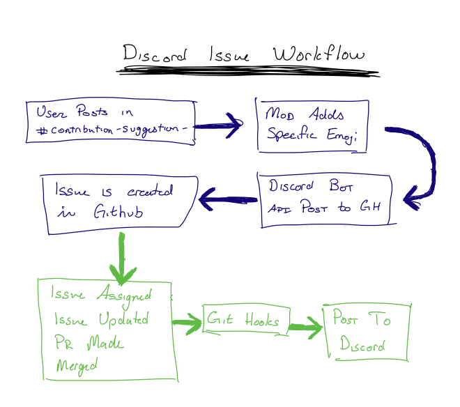

# Discussion



2020-04-21

Brought up workflow with mods in #modteam. Briggs brought up that the user may not use the correct wording.

Possible solution is to use a specific format:

```
Issue Title
> Issue body. The bot can parse this for us.
```

